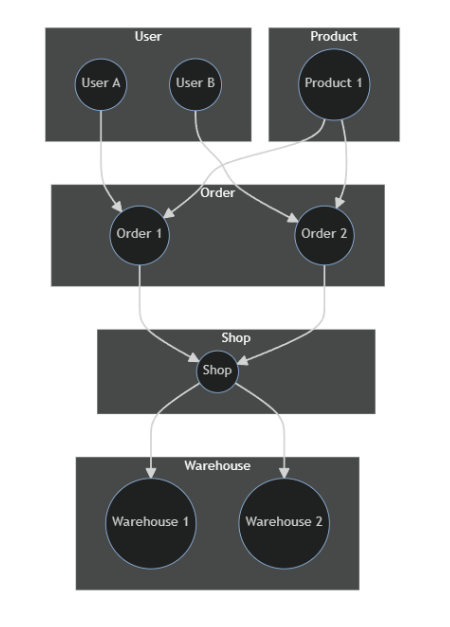

# go-market
[Case Study](case.pdf)



## Development Guide

### Collection Using Postman
- ./go-market.postman_collection.json
  
### Installation
- Clone this repo
    ```sh
    git clone https://github.com/adamnasrudin03/go-market.git
    ```

- Copy `.env.example` to `.env`

    ```sh
    cp .env.example .env
    ```
- Setup local database
- Start service API
    ```sh
    go run main.go
    ```

### Coverage Unit test
```sh
  make cover
```

## Build project by docker
- check ip address in terminal
    ```sh
        ipconfig
    ```
- change data environment in file ./docker-compose.yml
- build with docker compose
    ```sh
        docker-compose -f "docker-compose.yml" up -d --build 
    ```
    - with make file
    ```sh
        make docker-compose
    ```
    
## Structure Response
- Error
```json
{
  "status": "status error",
  "code": 10,
  "message": {
    "id": "message error language Indonesian",
    "en": "message error language English"
  }
}
```

- Success Single Data
```json
{
  "status": "Created",
  "data": {}
}
```

- Success Multiple Data
```json
{
  "status": "Success",
  "meta": {
    "page": 1,
    "limit": 10,
    "total_records": 3
  },
  "data": []
}
```

- Success response with message
```json
{
  "status": "Created",
  "message": {
    "id": "Data berhasil dibuat",
    "en": "Data created successfully"
  }
}
```


<br clear="both">
<h2 align="left">Connect with me:</h2>
<div align="left">
  <a href="https://www.linkedin.com/in/adam-nasrudin/" target="_blank">
    
  </a>
  <a href="https://adamnasrudin.vercel.app/blog" target="_blank">
    
  </a>
</div>